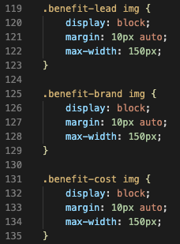
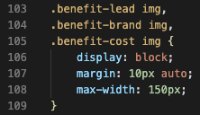

# Horiseon Marketing Agency Webpage Refactor

## Description

I was tasked with refactoring code to make it easier to read for the general population. I went into the "index.html" file and edited it to show semantic elements. This will allow a user to read the file more precisely. 

The original css file was very repetive. I updated it to be more minimal. The first screenshot shows a photo of original code. Followed by the second screenshot of some simplification. I was able to remove roughly 10 lines by simplifying the code. 

Screenshot #1

Screenshot #2

The deployed page can be found here:
https://tylerdins88.github.io/code-refactoring/

## Installation

N/A

## Usage

N/A

## Credits

I would like to thank Horiseon Marketing Agency for tasking me with this challenge. 